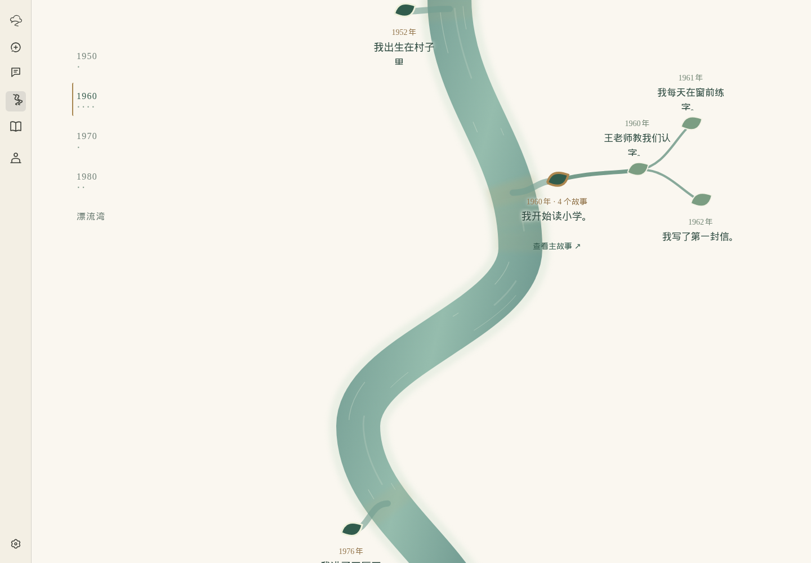
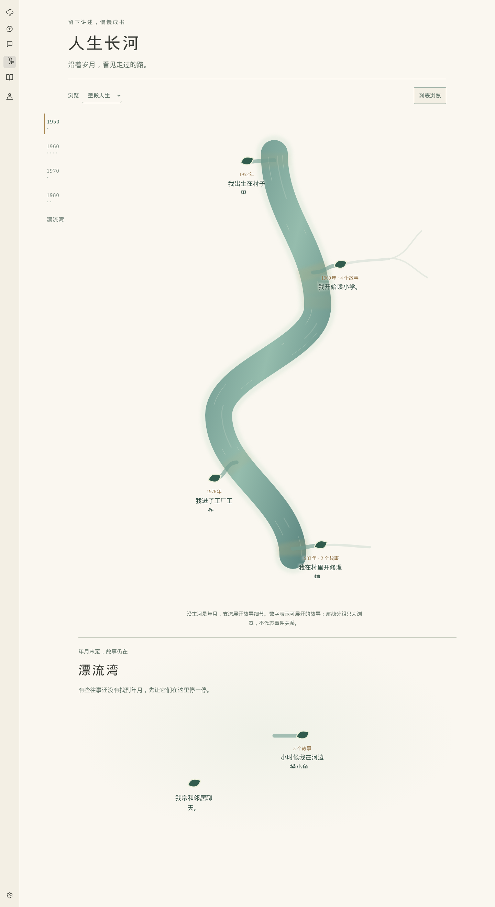
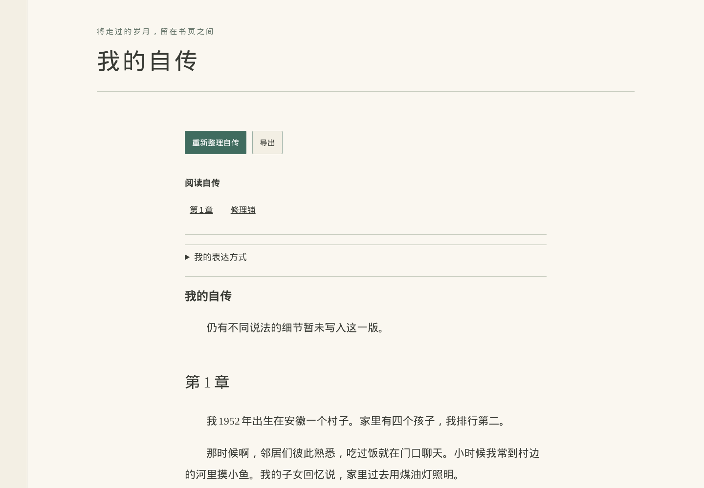
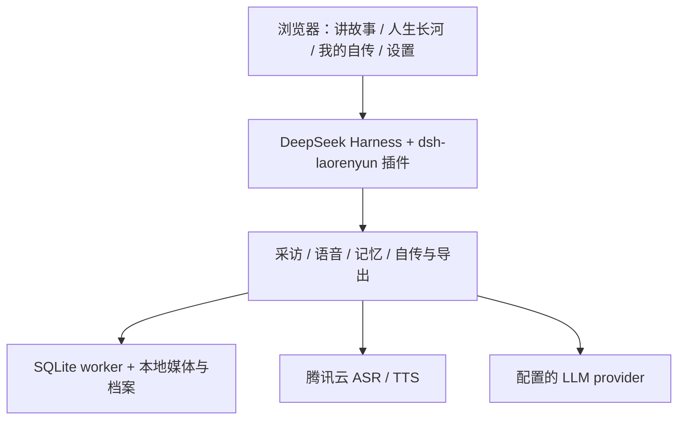

# 老人云 · Laorenyun

> 留下讲述，慢慢成书。

[](https://github.com/Develata/laorenyun/releases/latest)
[](https://github.com/Develata/laorenyun/actions/workflows/ci.yml)
[](LICENSE)




老人云是面向老年人的 AI 口述史与动态自传系统。用户通过语音或文字讲述经历，AI 以采访者身份逐步追问；原始证言与出处保存在本地，长期记忆组成可追溯的记忆图。用户可以沿“人生长河”浏览、纠正，再把讲述整理成带事实审校的自然自传。

[快速开始](#快速开始) · [最新版本](https://github.com/Develata/laorenyun/releases/latest) · [演示](docs/demo.md) · [文档](docs/README.md) · [报告问题](https://github.com/Develata/laorenyun/issues)

## 快速开始

当前提供 **v0.2.0 源码发行与本地 Docker 构建**。公共容器镜像尚未发布：对应源码交付门禁尚未通过，[原因与进度](docs/12-release.md#容器源码交付门禁)。没有可用的 GHCR pull 快捷路径。

只需 Docker 与 Compose，无需在宿主安装 Node、pnpm 或其他语言工具链：

```bash
git clone --branch v0.2.0 https://github.com/Develata/laorenyun.git
cd laorenyun
cp .env.example .env
docker compose up --build -d --wait
```

首次构建需要下载和编译，耗时取决于网络与机器。镜像为 `laorenyun:0.2.0`，默认只监听 `127.0.0.1:3080`。

在自己的终端查看 `docker compose logs`，打开 `dsh web:` 后的原生访问链接。**链接含访问秘密，请勿分享或录入视频。** 初次进入后，在设置中配置 AI 模型和腾讯语音，也可事先填写 `.env`。未配置云服务可以打开本地界面，但不能完成云端采访和整理；不会退回假结果。

手机访问需要 HTTPS 和正常访问保护，见 [部署说明](docs/10-deployment.md)。

## 适合哪些场景

- 和家中长辈一起保存童年、工作、家庭与故乡的故事。
- 分多次采访逐渐补全人生经历，每次从一个问题开始。
- 核对一段回忆的原话，留下更正，同时保留旧的说法。
- 整理一份可阅读、可查出处、可离线保存的个人自传。

## 核心体验

### 讲故事

AI 一次提出一个主问题。可以直接打字，也可以录音；腾讯语音识别形成可编辑草稿，由用户确认发送。问题可以朗读，保存和记忆整理状态会显示在采访中。

主线采访与局部追问分开：征得同意后展开一个支线故事，最多接纳五次回答，再回到主线。长程采访使用有界检索和覆盖启发式，而非每轮把完整人生档案塞进模型。

### 人生长河

主河流按时间向下流动，局部故事沿河岸展开成支流树。主河上的弧长表示时间；故事树的深度表示讲述的展开程度。相关和因果联系仅在选择时出现，领域记忆图没有被改成树。

没有年月的故事留在独立的**漂流湾**，不会为了排版被补上日期。支持年代跳转、键盘与列表浏览、减弱动画；展开的故事可进入独立详情，或在采访右侧快速查看。

<details>
<summary>查看人生长河总览</summary>



</details>

### 我的自传

固定一版事实材料，先规划章节，再写自然段落，由独立的原子事实审校与有界修复检查内容。多个记忆可以融入一段文字，不要求逐条照抄。无日期的故事自然讲述，家人代述保留归属，未解决的冲突不会任意选边。

“**我的表达方式**”来自用户主动整理的本人讲述，可查看依据并决定是否用于下一次自传。它只影响措辞、节奏与讲述习惯，不提供新事实，也不是心理画像。



### 人物档案与多次采访

一个人物档案对应一个长期的 DSH Workspace，一次采访对应一个 Session。新采访重新开始短会话，却保留同一人的记忆、原声、画像和自传；不同人物档案相互隔离。

以上画面为已提交的 v0.2 验收截图，使用合成数据；不代表实体麦克风测试。

## 证言、记忆与纠正

每段已提交文字都有来源和说话者。录音还保留原件、识别草稿及修改后的转写。记忆详情可以追溯原始讲述，有音频时可回听整段来源。

点击“**这里不对**”会建立新证言，经正常抽取与冲突流程形成新修订。旧证言不被覆盖。自传当前主张只引用有效支持材料；被更正的历史仍保留在档案里。

**AI 抽取和事实审校不是独立历史核实，也不保证完美事实准确性。** 阅读和纠正仍由人完成。

## 数据、隐私与云服务

- SQLite 档案、原始录音和派生文件保存在本地 Docker 卷。
- 腾讯云处理识别所需音频、朗读所需文字；模型供应商处理采访与整理所需文字。
- 不是完全离线 AI，不承诺第三方零留存。模型与语音密钥由 Host 配置保存，不回填到浏览器。
- 导出可能包含家人姓名、经历和来源文本，分享前请自行检查；系统不会自动上传或创建公开分享链接。

[出处规则](docs/07-provenance-and-integrity.md) · [部署与数据目录](docs/10-deployment.md)

## Docker 部署

一个应用容器、一个持久卷、一个 SQLite worker；默认非 root（10001:10001），保留访问保护、`cap_drop` 和 `no-new-privileges`。健康检查不调用付费云服务。

目前使用上述本地构建流程。未来镜像发行必须先通过实际镜像验收和完整对应源码交付门禁，再提供固定 digest 的 Compose。流水线存在不代表镜像已经发布；当前分发状态由 [发布操作](docs/12-release.md) 说明。

## 导出与备份边界

可下载 `autobiography.md`、离线 `index.html` 和 `memories.json`。阅读文件保留正文实际使用的来源；JSON 保存所绑定档案快照的修订与纠正历史。HTML 无远程脚本、字体或网络依赖。

**导出不是完整备份，不包含媒体文件，不提供导入恢复。** 技术维护者的整卷备份、停机与数据移除方法见 [数据运维](docs/10-deployment.md)。

## 为什么基于 DeepSeek Harness

复用成熟的会话、模型配置、原生编辑器、工作区、侧栏和插件生命周期。老人云自己拥有证言、记忆、纠正、采访调度、支线边界和派生导出；模型是可更换的推理服务。



| 仓库 | 责任 |
|---|---|
| [laorenyun](https://github.com/Develata/laorenyun) | 产品规范、固定上游、Docker、发行与部署 |
| [dsh-laorenyun](https://github.com/Develata/dsh-laorenyun) | 领域业务、Host/Client 插件、接口和测试 |

**DSH 上游源码修改：0。** [DSH pin](UPSTREAM.json) 和 [插件 pin](PLUGIN.json) 均固定完整提交。没有另造一个 Web 壳，也没有给采访 Agent 开启 shell 或文件系统工具。

## 已知限制

- **R2 physical microphone: PENDING**
- **R3 physical-human recovery: PENDING**
- 实体手机/iOS 与真实 Safari 覆盖不完整，没有逐字原音对齐。
- 没有照片采访、ZIP、导入恢复、声音克隆、全双工通话、心理画像。
- 记忆图保留不确定性；河流是有界启发式投影，不承诺任意图最优布局或 10k 节点性能。
- 公共二进制镜像的对应源码交付未完成，不能把本地镜像当成已获准分发的产物。

<details>
<summary>工程验证、固定依赖与历史证据</summary>

普通 CI 不使用云密钥。[上游整合](UPSTREAM.md) 说明零源码修改和冻结 packaging lock；[测试策略](docs/11-testing-strategy.md) 区分确定性测试、合成场景、真实模型和硬件门禁。[v0.2.0 发行边界](docs/release-v0.2.0.md) 与 [历史证据索引](docs/README.md#历史证据) 保留各阶段实际结果。

源构建支持 linux/amd64。固定依赖版本不等于证明逐字节可重复构建；Debian 源包和注册表的可获取性仍影响重建。

</details>

## 参与贡献

先读 [架构与不变量](docs/02-architecture.md) 及相关模块文档。两库 main 禁止强推和删除，合并前必须通过各自 CI：使用短分支 → push → CI → PR 合并。不要求额外审批人数，不以关闭保护绕过失败。产品改动与发布工程分别审查，云测试须明确授权。

## License

原创代码与文档采用 [MIT](LICENSE)；DSH、腾讯 SDK、FFmpeg、libvips 等保持各自许可。许可通知不等同于对应源码交付，当前与历史分发审计见 [THIRD_PARTY_NOTICES](THIRD_PARTY_NOTICES.md)。
