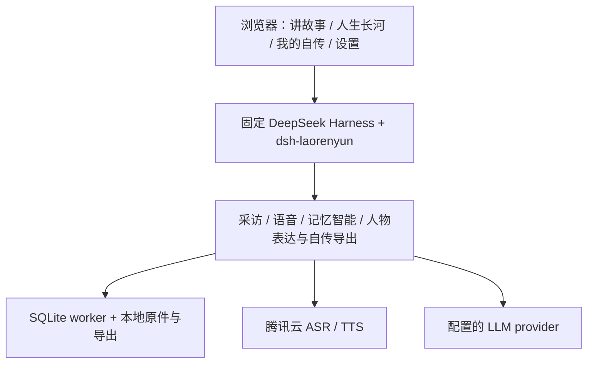

# 老人云 · Laorenyun

让讲述留下来，让人生慢慢成书。

老人云是面向约60–80岁使用者的AI口述史与动态自传系统。可以说话或输入文字，AI以采访者身份追问，把原声、转写、时间记忆与出处保存在本地，形成可纠正、可回听、可导出的个人自传。AI抽取表示“证言中有这句话”，不代表独立历史核实。

**v0.2.0-rc.3 候选**：人物档案隔离、独立长河与自传阅读、原生设置、自由叙事与独立事实审校。**当前支持出处与阅读导出已修正；本轮真实复验2/3发布，审校格式修复超时仍阻塞正式标签。** 当前验收见 [v0.2](docs/v0.2-redesign.md)。[v0.1.0课程发行](docs/release-v0.1.0.md)与tag保持不变；实体麦克风R2和真人采访恢复R3仍待作者验收。没有公开预构建镜像，使用本地Docker构建。

## 能做什么

- 四个主要入口：**讲故事 / 人生长河 / 我的自传 / 设置**。腾讯Flash识别只产生可编辑草稿，必须本人发送；腾讯TTS朗读采访问题。
- 主线按年代采访，支线征得同意后隔离探索，Host强制最多五次真人回答。
- SQLite时间记忆图保留不确定时间、漂流记忆、冲突和不可变修订；只读工具按需展开出处，有界覆盖启发式帮助选择下一阶段。
- “这里不对”创建新证言，不覆盖旧记录。
- 显式整理本人语言表达画像；固定事实清单生成连贯第一人称自传，允许合并和改写，由独立审校检查事实；家人代述自然归属、未解争议不任选一方。
- 下载Markdown、无网络依赖的HTML和memories.json；媒体不包含在三文件中，**不是完整备份，不提供导入恢复**。

## 为什么使用DeepSeek Harness

复用DSH的会话、模型路由、工具、子会话、原生编辑器与Web插件机制，避免重造通用Agent基础设施。Laorenyun自己拥有出处、时间图、修订/纠正、支线边界、调度、语音原件和派生导出；模型只是可更换的推理服务。



## 运行：只需Docker与Compose

```bash
git clone https://github.com/Develata/laorenyun.git
cd laorenyun
cp .env.example .env
# 在本机填写模型、腾讯凭据，不提交.env
docker compose up --build -d
```

在本机私密终端运行`docker compose logs`，从`dsh web:`打开原生访问链接；**链接含秘密，不分享、不录进演示视频**。宿主默认只监听`127.0.0.1:3080`。使用者无需Node、pnpm、Python或Rust。镜像名`laorenyun:0.1.0`，linux/amd64；未承诺ARM64或逐字节相同构建。

`.env.example`分组说明三种模型协议和腾讯配置。演示默认`16k_zh`已匹配普通Flash免费包；`16k_zh_en`等大模型引擎额度独立，不自动切换。模型/腾讯完全未配置可启动本地健康界面，但不能完成云端采访；部分配置错误启动即明确失败。

[部署与数据运维](docs/10-deployment.md)包含手机HTTPS、访问保护、持久卷、完整卷备份及停机说明。[5–8分钟演示](docs/demo.md)使用独立合成卷，含云不可用时的离线方案。

## 两仓库与可重复构建

| 仓库 | 权威责任 |
|---|---|
| [laorenyun](https://github.com/Develata/laorenyun) | 完整应用、固定上游源码、产品规范、Docker发行和发布证据 |
| [dsh-laorenyun](https://github.com/Develata/dsh-laorenyun) | 独立业务插件、类型/接口、领域与浏览器实现、确定性测试 |

DSH由[UPSTREAM.json](UPSTREAM.json)固定，插件由[PLUGIN.json](PLUGIN.json)固定完整SHA；不依赖插件main，不复制sibling工作树，DSH源码改动为零。冻结npm锁和基础镜像digest；Debian依赖的可获取性仍影响重建，见[上游整合](UPSTREAM.md)。

## 隐私与明确边界

原始档案在本地；腾讯处理音频/朗读文本，模型供应商处理采访与整理所需文字。不是离线AI，也不承诺供应商零留存。导出可能包含亲友姓名、经历和来源，分享前自行检查。

没有账号、付款、原生App、声音克隆、全双工通话、心理画像、照片采访、ZIP或导入恢复。人物画像只影响表达，不能增加事实。实体硬件、Safari/手机测试范围及单次生成容量上限见[发行状态](docs/release-v0.1.0.md)。

原创[MIT](LICENSE)；第三方分别遵守[各自许可](THIRD_PARTY_NOTICES.md)。FFmpeg含GPL组件；对应源码交付尚未全部完成，因此不发布公共二进制镜像。

## 开发与Context Control Plane

先读[AGENTS](AGENTS.md)、[架构不变量](docs/02-architecture.md)，再按任务加载：

- 规范：[采访](docs/03-interview-agent.md)、[记忆图](docs/04-memory-graph.md)、[语音](docs/05-speech-pipeline.md)、[界面](docs/06-ui-ux.md)、[出处](docs/07-provenance-and-integrity.md)、[人物表达](docs/08-persona-distillation.md)、[自传/导出](docs/09-export-format.md)。
- 证据：[Phase1](docs/phase-1.md)、[Phase2](docs/phase-2.md)、[Phase3](docs/phase-3.md)、[Phase4](docs/phase-4.md)、[最终发行](docs/release-v0.1.0.md)。历史状态不反推当前未测门禁。
- 研究/决定：[ADR索引](docs/adr/README.md)、[依赖审计](docs/research/dependencies.md)、[测试](docs/11-testing-strategy.md)。

CI只跑离线检查与本地容器健康，不需要云密钥。开发诊断使用`laorenyun-dev`，正常quick start保持`laorenyun`。

## 人物档案与设置

一个人物档案对应一个 DSH Workspace；“新一次采访”建立新的会话，但共享该人的记忆、原声、表达画像和自传。不同档案隔离。旧 v0.1 数据原地保留为默认人物档案；启动迁移幂等，不删除历史。

本机 Web 设置可配置原生 AI 服务/密钥及新采访默认模型，语音设置可覆盖 `.env` 的腾讯参数。密钥不回填界面。设置不赋予采访 Agent shell/文件系统权限。手机仍需 HTTPS 和正常 DSH 访问保护。
