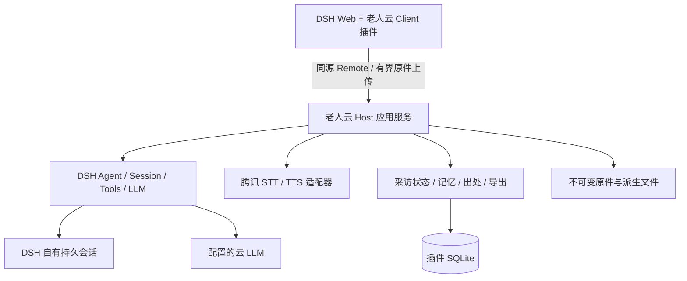

> Phase 2 实际接入与验证状态见 [phase-2](phase-2.md) 和 [ADR-0015](adr/0015-phase-2-speech-and-interview.md)。完整产品规范仍含未来阶段，不能视为全数已实现。

# 系统架构与不变量

> Phase 1 当前实现与证据见 [phase-1](phase-1.md)；本文件保留完整产品规范，未标为已实现的能力仍属后续阶段。

Owner：本文件拥有模块/权威边界和全局不变量。具体类型唯一 owner 是[插件 contracts](https://github.com/Develata/dsh-laorenyun/blob/main/docs/contracts.md)。

一个容器、一个 DSH Host 进程、一套领域库；不引入独立微服务。TypeScript 负责业务；Node/原生工具是发行依赖，不要求最终用户自行安装。原则是零 agent-loop patch。

## 一个事实，一个 owner

| 事实/操作 | 权威 owner | 其他层的职责 |
|---|---|---|
| 产品/P0/P1/不变量/ADR | laorenyun/docs | 插件链接引用 |
| 镜像、Compose、环境、上游 pin、发行许可 | laorenyun | 插件提供构建产物和配置要求 |
| 类型、工具与 Remote 契约、适配文件图 | dsh-laorenyun/docs | 本库只解释产品语义 |
| 源录音/照片、hash、可用状态 | 插件 RecordingStore/媒体存储 | DSH attachment 是模型投递副本，不替代源档案 |
| ASR 原文、修订文字、speaker、操作状态 | 插件 SQLite | UI 为可恢复镜像；DSH 消息为运行记录 |
| Session 日志、LLM 请求与原生 inbox | DSH | 插件通过公开 API 使用，不直接写上游表/日志 |
| 记忆主张/冲突/时间/修订 | 插件 MemoryRepository | LLM 提案，确定性校验与用户确认；UI 不直写 DB |
| Branch 生命周期及 5 次计数 | 插件 InterviewCoordinator | DSH 提供子会话；模型不拥有计数 |
| 自传/Persona/导出 | 插件派生服务 | 输入版本和来源固定，可再生成 |

DSH session 和领域 DB 不是分布式原子事务。桥接操作必须有 durable operation ID、幂等及重启对账；不得声称两者能同一事务提交。模型可见的补充上下文必须通过 DSH 可重建的已记录通道进入。

## 依赖方向

Client → Host Remote → application services → domain contracts；Tencent、SQLite、filesystem、DSH adapter 实现 contracts。domain 不 import Tencent/React/DSH runtime。一个插件包内按上述模块分目录即可，不为每个接口创建 npm 包。

发行层以后保存 `upstream/deepseek-harness/` 精确源码快照（或等效固定源码归档），保留上游 LICENSE/NOTICES，原创 `distribution/`、`profiles/`、`deploy/` 与其分离。插件以精确版本 tarball + 完整性 hash 安装；开发相邻 checkout 不是发行依赖。不要求 GitHub fork 关系，不用浮动 git dependency。升级逐项回归窄适配层，详见 [ADR-0001](adr/0001-deepseek-harness-foundation.md)。Phase 0 尚不引入整棵上游树。

## 必须保持的不变量

| ID | 不变量 |
|---|---|
| I01 | 原始材料绝不被静默销毁；删除草稿/重录/会话不会删除原件 |
| I02 | AI 推断绝不标记成使用者明说的事实 |
| I03 | 自传是派生数据，不是事实源 |
| I04 | 结构化记忆是事实领域层，且保留主张出处与确认状态 |
| I05 | Persona 只影响 HOW，绝不创造 WHAT |
| I06 | 识别只生成可编辑草稿，绝不自动提交 |
| I07 | 界面可操作状态由确定性软件决定，LLM 无开关控制权 |
| I08 | Branch 最多五次已接纳的独立用户回答，重试不重复计数 |
| I09 | Main 不在每轮读取完整人生档案，采用有预算的渐进检索 |
| I10 | 重要生成主张在可行时追溯节点版本、文字段和音频范围；缺口必须显示 |
| I11 | 历史矛盾显式呈现，不静默裁决 |
| I12 | 云 API 失败绝不擦除已保存录音 |
| I13 | 说话者由显式选择决定，自动识别只可作为非权威提示 |
| I14 | 最终部署保持 Docker image + Compose + env 可复现，无宿主语言工具链要求 |

## 生命周期、规模与升级

单 Host 单 writer，操作串行到领域事务；两个浏览器仅一个持有采访写租约，其他只读。任务表承担本进程可恢复工作，不建设消息队列。外部请求一律 signal + 总截止时间 + 有限重试；进程停止后未终结操作以 interrupted/recoverable 恢复，不自动重发不确定的云识别请求。

领域版本与 DSH session 格式独立。迁移前停写并备份整个数据根；`PRAGMA user_version` 单调增加，SQL 事务迁移失败回滚；遇到未来版本拒绝写入。回退程序不等于回退数据，恢复匹配快照后才回退。原件增长与生成缓存回收见 [部署](10-deployment.md)。
