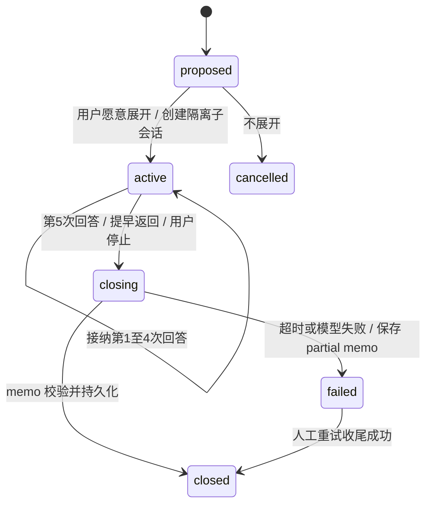

> Phase 3 实现/验证见 [phase-3](phase-3.md) 与 [ADR-0016](adr/0016-phase-3-memory-and-branch-admission.md)；Phase 2 两项真人硬件门禁仍 pending。

# 采访行为、上下文与主支线

Owner：本文件拥有行为和生命周期语义；[插件 interview](https://github.com/Develata/dsh-laorenyun/blob/main/docs/interview.md) 拥有 DSH 接入方式。

## 采访规范

依据 [OHA 最佳实践](https://oralhistory.org/best-practices/) 与 [Dart 创伤采访指导](https://dartcenter.org/sites/default/files/Interviewing%20Victims%20%26%20Survivors.pdf)：开放提问、尊重叙述权和拒答、关注访谈者同意与原件保存。采用记者的具体澄清和复述核对，避免暗示答案。AI 不是历史鉴定者。

一次一个主问题；先听完，再用人物/场景/感官线索追问；不要把六要素变成问卷。默认顺时间，重要意外记忆可跟进。遇到敏感经历先询问是否愿意继续，不追问细节、不归罪、不作诊断。沉默不是超时失败；用户随时停止，不设 Main 总轮数上限。外部单次请求超时与人的思考时间分开。

## 第一访谈

`not_started → active → paused → active`，用户主动结束可 `closed` 后另开访谈；人生档案持续。点击“开始讲我的故事”使用幂等 operation ID 创建 Main session 与 interview 记录，先问“我们先从最开始聊起吧。您是在哪里出生的？”下一步自然问“大概是哪一年？”未知年份不阻塞初始化，出生资料也只是有来源的记忆。双击/刷新恢复同一个初始操作。

## 渐进式 skill

插件 `skills/oral-history-interviewer/SKILL.md` frontmatter 含 `name`、`description`；入口约 1–2 页，列角色、单问、拒答、出处和检索规则。`references/` 放 `questioning.md`、`chronology.md`、`sensitive-topics.md`、`clarification.md`、`branch-policy.md`。按触发条件通过受限 skill resource 工具读具体文档，不把全部资料塞入 system prompt。其内容是本文件政策的操作化，不建立第二套规则。

## Main 的上下文预算

每次注入当前目标、近期最多 8 个对话回合、高层生平摘要、当前时间区间、最多 12 条节点 key_sentence、最多 5 个未解问题/冲突提示。项目新增上下文目标 ≤4,000 tokens，预留 30% 模型窗口供回复和工具；连同 DSH 历史做总预算，较小模型须缩小历史。不是“8 轮后结束访谈”。

摘要有输入版本、来源节点和生成版本，不可作为新的事实证据。用 timeline 工具按需深入，单次最多 50 条、10 个来源段；超过预算返回 truncated/cursor。DSH compaction 保留运行历史，长期记忆只从领域库检索；不可直接扫 DSH 日志作为替代 RAG。

## Branch 状态机

- Main 提出值得深入的主题，Host 记录主线暂停位置和返回桥。最多一个活动 Branch、深度 1；不允许 Branch 再分支。
- 使用 fresh spawn 可续接子会话，不 fork 全部父历史。输入仅主题、相关节点和该故事来源。主线暂停提问，UI 仍是同一采访体验，当前输入地址切换到 Branch。
- `answer_count` 只计用户显式提交并被 Host 接纳的非空回答，以 source-turn/message ID 去重；编辑、ASR 重试、TTS、模型步骤、系统收尾提示不计数。第五次先持久保存回答，再进入 closing；模型不能发第六问，也不能靠报错/重启清零。
- closing 不向普通界面流式展示模型原始输出，也不送TTS；模型可见材料仍由DSH日志保留。Host运行有界内部结构任务，成功/失败后界面回到Main；这使“第五答后不再问第六问”不依赖prompt服从。
- closing 只允许产生结构化 BranchMemo：title/key_sentence/summary/source_turns/related_memory_nodes/new_memory_candidates/people/places/time/unresolved_questions/suggested_return_bridge，另有 status 和生成输入版本。候选不是直接 confirmed 事实。
- memo 最多 60 秒，一次格式修复且在同一预算内；失败时程序保存 partial memo（已知主题、source_turns、未完成标记，摘要可空），不杜撰成功摘要。原答案仍完整，Main 用保守固定桥接语返回。
- memo + branch status + 回流操作同一领域事务；回流以 branch ID 去重。Main 只加载短 memo 与节点索引，需要时读取全文。
- 断线不结束 Branch；重启按计数恢复。用户停止时立即停止提问/播放，保存 partial memo，可以后再整理。中断 DSH 的 ack 不是已停止证明，必须观察 quiescent 或到停机截止后标记 interrupted。

## 覆盖感知调度

顺时间为默认，仅自然话题边界触发。不是 Poisson 过程，也不宣称为已发表标准算法；借鉴 [active learning survey](https://burrsettles.com/pub/settles.activelearning.pdf) 的覆盖与不确定性思想，未证明对老人采访有效。

将已知出生年至今按十年分区，最多 12 个候选；未知出生年时按已知事件附近区间询问，不猜年龄。排除用户拒谈/近期刚问/不存在的未来区间。

`G` = 距最近已锚定记忆的间隔，经 120 月截断归一化；`C=1/(1+n)`（n 为该区间 confirmed 节点数）；`U=min(未解问题+冲突数,3)/3`；`R` = 与当前区间连续性，`max(0,1-距离月/120)`。

`S=.30G+.30C+.20U+.20R`；`p_i=exp((S_i-max S)/.25)/Σexp(...)`。权重/温度是可解释项目启发式初值，需用访谈评估调整。记录候选、分数、随机种子和选中原因便于复现；不保存私密文本到日志。不让“冲突多”压过用户不愿谈，不在一段故事中途随机跳题。无候选继续当前线索或让用户选择。

Phase 3实际新增上下文限制为4000字符（比上方token目标更保守），工具总输出12000字符/轮；历史达到九个保留真人轮时批量调用原生压缩，保留最近两轮加新输入，原生日志不删除。严格日历/完整原句限制及failed操作处理见插件实现报告。
